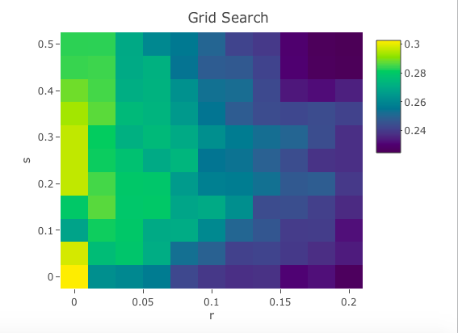

Simple Models for Predictive Policing
========================================================
author: Stat 157 Group 1
date: 2017.12.07
autosize: true
font-family: 'Avenir'
transition: linear

Introduction
========================================================
type: section

Predictive Policing
========================================================
- the usage of mathematical and analytical techniques in law enforcement to identify potential criminal activity
- police officers can anticipate crime in advance and be present on the purported crime scene to prevent the crime from happening

ETAS Models
========================================================
- ETAS: Epidemic Type Aftershock Sequences
- self-exciting point process
- two main assumptions

  1) that earthquakes can be split into parent and offspring events through seismicity
  
  2) the arrival of parent earthquakes is Poisson-distributed

Drawbacks of Current Predictive Policing Models
========================================================
- disproportionately expensive
- police departments blindly trust model outputs which suffer from the same biases that are systematically found in modern police practices

Literature Review
========================================================
type: section

Lum 2016
========================================================
- “police officers – either implicitly or explicitly – consider race and ethnicity in their determination of which persons to detain and search and which neighbourhoods to patrol”
- “results in increasingly disproportionate policing of historically over-policed communities”

Luen 2010
========================================================

Mohler 2011 & Mohler 2016
========================================================

Methodology
========================================================
type: section

Data
========================================================
- drug_crimes_with_bins.csv ("bin","OCCURRED","LAG")
- oakland_grid_data.rds (geographical coverage of Oakland bins)

Conceptual Overview of Model
========================================================

Two features that may help us predict in which bins crime may take place:

* Historical data from each bin
* Historical data from each bin's neighbor bins

We will combine these two to arrive at a $\textit{total bin score}$ for each bin on each date.

Historical Crime Score
========================================================

To assess today's historical crime score for each bin, we looked at crime data for the trailing 365 days and calculated a weighted sum. The weights were a simple exponential decay function, as shown below:

$$W_{t} = e^{-rt}$$

where $\textit{t}$ is the lag for that particular historical date. 

Historical Crime Score (cont.)
========================================================

Formally, the historical crime score equation is reproduced below:

$$H_{i,\tau} = \sum_{t=1}^{365} W_{t} \times C_{i, \tau - t}$$

where:

* $C_{i, \tau - t}$ = Number of crimes that occurred in bin $\textit{i}$ at time $\textit{\tau - t}$
* $\tau$ = Today's date
* $\textit{t}$ = The time lag
* $\textit{r}$ = The exponential decay rate

Neighbor Crime Score
========================================================

In addition to crime in the bin itself, we incorporated the historical crime from neighboring bins in order to capture "spillover rates" and bins in high crime areas. The neighbor crime score of bin $\textit{i}$ was simply the sum of the $\textit{historical crime scores}$ of the neighbors of $\textit{i}$:

$$N_{i,\tau} = \sum_{n \in N_{i}} H_{n,\tau}$$

where:

* $\textit{i}$ = Bin number
* $N_{i}$ = List of neighbors of bin $\textit{i}$
* $\tau$ = Today's date

Bin Score
========================================================
To compute the final bin score, we calculated a weighted sum of the $\textit{historical crime score}$ and the $\textit{neighbor crime scores}$, with weight $\textit{s}$, which we call the neighbor coefficient:

$$score_{i,\tau} = (1-s) \times \sum_{t=1}^{365} e^{-rt} C_{i, \tau - t} + s \times \sum_{n \in N_{i}} \sum_{t=1}^{365} e^{-rt} C_{n, \tau - t}$$

Unit Testing Our Model
========================================================
We utilized the `testthat` testing framework in R to unit test our functions.

Tested functions:
- `get_trailing_table`
- `get_bin_score`
- `get_bin_scores`
- `get_neighbor_adjusted_bin_score`
- `get_maximal_capture`
- `get_predicted_bins`

Results
========================================================
type: section

Tuning Our Model
========================================================

We performed a grid search to find the optimal parameter set for our exponential decay rate (r) and our neighbor coefficient (s). The results are shown below:

*Final Chosen Model*: r = 0.00, s = 0.00

AUC Curve Comparison
========================================================
For varying number of police officers deployed, we compared the percent of crimes missed by the model between our model and PredPol.

Discussion
========================================================
type: section

Interpretation of Results
========================================================

Limitations
========================================================

Social Consequences
========================================================
